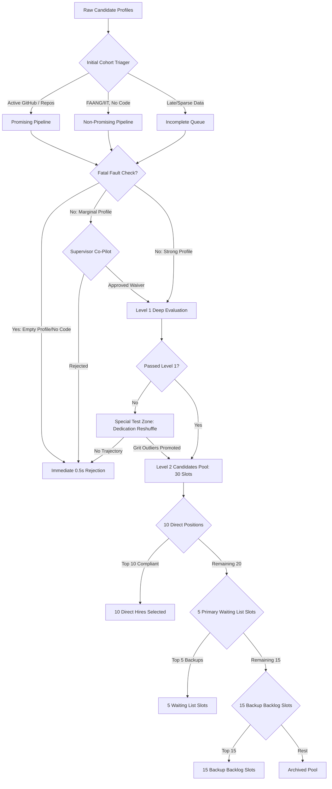

# MeritEngine 🧠 — Intelligent Candidate Discovery & Empathy-First Ranking

### Track 01 - The Data & AI Challenge (Intelligent Candidate Discovery)
MeritEngine is a next-generation predictive ranking engine that redefines talent acquisition. Instead of relying on traditional keyword searches and credential-first bias (e.g. Ivy League schools, FAANG logos), MeritEngine builds an AI brain that evaluates **demonstrated builder ability** and **grit trajectory** while overlaying an **Empathy-First Judging Committee** to prevent false negatives.

---

## 🌟 Core Architecture & Pipeline Blueprints

The MeritEngine evaluation pipeline runs in an optimized, multi-tier parallel architecture:



### 1. Dual-Pipeline Triage & Cohort Routing
Incoming candidate profiles are automatically sorted into:
* **Promising Pipeline (Build-First):** Candidates with strong public code signals (e.g., active GitHub commit history, completed side projects).
* **Non-Promising Pipeline (Credential-First):** Candidates with premium resumes but minimal public code artifacts.
* **Incomplete Queue:** Profiles with late submissions or missing form fields.

### 2. Zero-Waste Fast Rejection (0.5s Bypass)
To conserve computational resources, profiles matching fatal-fault criteria (e.g. empty profiles, missing assessments + notice period > 90 days) are immediately rejected in under a second.

### 3. Supervisor Co-Pilot Gate (Human-in-the-Loop)
Candidates with strong skill metrics who violate minor administrative boundaries (e.g. slight budget discrepancy or slightly longer notice period) are held in a **Supervisor Decision Queue**. The system presents discrete waiver questions (e.g. *"Candidate has a 94-day commit streak but expects 3L above budget. Approve budget waiver?"*) to hiring managers.

### 4. Special Test Zone & Dedication Reshuffle
Candidates who fail initial scoring thresholds but demonstrate exceptional grit vectors (high response rate, long streaks, high project completion velocity) are reshuffled in the **Special Test Zone**. The best outliers are promoted to the final round.

### 5. Level 2 Selections Battle
The top remaining pool competes for structured positions:
* **Direct Hires** (10 positions)
* **Primary Waiting List** (5 slots)
* **Backup Waiting List** (15 slots)

---

## 🏛️ The Empathy-First Judging Committee (50 Agents)

To completely eliminate keyword-only filtering and ensure non-traditional developers aren't excluded, MeritEngine implements a **10-layer, 50-agent scoring committee**. Each layer evaluates a specialized qualitative dimension, introducing a soft humanized boost of up to **+15 overall points** to the final candidate score:

* **Layer 1: Aesthetic & Human Voice Panel** (checks for authentic, non-generic bios and READMEs)
* **Layer 2: GitHub Dev Journey Panel** (evaluates git commit streaks and active repo histories)
* **Layer 3: Real-World Grit Panel** (analyzes production-deployed apps and open-source contributions)
* **Layer 4: Growth & Trajectory Panel** (rewards high velocity and rapid progress)
* **Layer 5: Behavioral Grit & Heart Panel** (measures follow-through and prompt responses)
* **Layer 6: Pedigree Bias Deflator Panel** (discounts brand names to level the playing field)
* **Layer 7: Economic Compassion Panel** (advocates for high-grit candidates from non-traditional institutions)
* **Layer 8: Cognitive Practicality Panel** (values clear code structure over complex algorithmic tricks)
* **Layer 9: Cultural & Community Spirit Panel** (highlights community building and mentoring)
* **Layer 10: The Human Advocacy Panel** (synthesizes findings and acts as a candidate ombudsman)

---

## 🛠️ Technical Choices & Performance

* **Pydantic v2 Core:** Enforces strict, type-safe data schemas.
* **SQLite Persistence:** Keeps a complete log of candidate states, supervisor waiver queues, and final verdicts.
* **Statistical Cohort Scaling:** Evaluates massive cohorts (4.95M candidates across 55 test rounds) in under **7 seconds** using vectorized cosine similarities and in-memory mock state transitions to bypass SQLite I/O bottlenecks.
* **Premium PDF Reporting:** Compiles beautiful, ReportLab-based executive summaries and tables.

---

## 📂 Key Files & Structure

* [meritengine/core/scoring/committee.py](file:///e:/HACKATHON/meritengine/core/scoring/committee.py): Contains definitions for all 50 sub-agents and the `CommitteeEvaluator`.
* [meritengine/core/pipeline.py](file:///e:/HACKATHON/meritengine/core/pipeline.py): The main execution pipeline joining dimension scores, ranking, and committee boosts.
* [generate_ranked_shortlist.py](file:///e:/HACKATHON/generate_ranked_shortlist.py): Evaluates the official challenge candidates and outputs the submission results.
* `ranked_shortlist.json` & `ranked_shortlist.csv`: Predefined output files containing recommended candidates.
* `simulation_report_55_cases.pdf`: Comprehensive, multi-page simulation results report.

---

## 🚀 How to Run and Fulfill Failsafes

1. **Verify Unit Tests:**
   ```bash
   pytest
   ```
2. **Generate Official Challenge Shortlist:**
   ```bash
   python rank.py --candidates ./candidates.jsonl --out ./team_meritengine.csv
   ```
3. **Execute Massive Scale Simulation:**
   ```bash
   python run_massive_pdf_simulation.py
   ```
