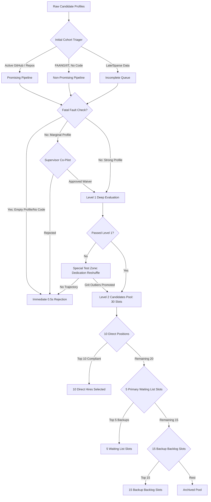

# MeritEngine — Core Philosophy and Advanced Pipeline Blueprint

This document details the original recruitment philosophy of MeritEngine alongside our advanced multi-tiered, human-in-the-loop candidate routing pipeline.

---

## 1. Our Initial Moto: "Demonstrated Reality"

The core mission of MeritEngine is to build an intelligent candidate ranking engine that prioritizes **demonstrated capability** over **traditional pedigree**. 

* **The Problem:** Recruiters are overwhelmed by resumes and rely on shortcuts—hiring from "Tier-1" colleges (IITs, Stanford) and "Brand" companies (Google, Microsoft), often missing exceptional builders from humble backgrounds.
* **The MeritEngine Solution:** 
  * **Skill & Hunger Over Credentials:** We measure actual code footprints, active commit cadences, take-home coding challenges, and side projects.
  * **Pedigree Dampening:** Automatically discounts brand credentials if they are not backed up by verified public work, preventing credential-first bias.
  * **Growth Boost:** Multiplies scores for self-taught/non-pedigree candidates showing an accelerating trajectory (high commit volume, streaks, and custom take-home architectures).

---

## 2. The Advanced Pipeline: "Humane, Efficient, & Multi-Tiered"

As the candidate pool grows, we need to balance **hiring speed**, **computational efficiency**, and **humane selection** (preventing false negatives). We introduce a parallel routing architecture:

### Step A: Initial Cohort Triaging (Simultaneous Filtering)
Incoming profiles are dynamically segmented into three streams to optimize evaluation paths:
1. **Promising Pipeline (Build-First):** Candidates with strong public code signals (active GitHub repositories, completed side projects).
2. **Non-Promising Pipeline (Credential-First):** Candidates with high-pedigree resumes but weak/missing public code samples.
3. **Incomplete / Late Forms:** Candidates with missing assessments, slow behavioral response rates, or incomplete logistics details.

### Step B: Zero-Waste Fast Rejection
To save processing time and system resources:
* Candidates in any stream with **fatal faults** (e.g., failed to submit assessment + zero side projects + notice period > 90 days) are immediately rejected in the first half-second. No manual review, interview, or deep evaluation is wasted on them.

### Step C: The Supervisor Co-Pilot Gate (Human-in-the-Loop)
To ensure we do not lose "hidden gems" due to strict rules:
* Marginal candidates (e.g., high skill but slightly over budget, or long notice period but exceptional assessment) are routed to a **Supervisor Decision Queue**.
* The AI presents clean options: *"Candidate has a 94-day commit streak but expects 3L above budget. Approve budget waiver? [Approve / Reject]"*.
* If **Approved**, they merge back into the main pipeline; if **Rejected**, they are immediately filtered out.

### Step D: The Special Test Zone (Dedication Reshuffle)
* Candidates who failed the initial automated cut but showed high indicators of grit/past action (e.g., high response rate, long streaks, but low experience) are moved to the **Special Test Zone**.
* A secondary AI-shuffling algorithm re-evaluates them, focusing heavily on **dedication and velocity**. The top outliers from this zone are promoted to Level 2.

### Step E: Level 2 Selections Battle
The final survivor pool (e.g., 30 candidates) enters a multi-stage allocation fight:
1. **The Direct Hires (10 Seats):** The top 30 candidates compete. The top 10 who pass all compliance gates (CTC, location, notice period) are awarded the direct hire seats.
2. **The Primary Waiting List (5 Seats):** The next 20 remaining candidates compete for 5 primary backlog slots.
3. **The Backup Waiting List (15 Seats):** The remaining 15 candidates compete to build the final backup pipeline.

---

## 3. How the Updated MeritEngine System Map Looks


## Appendix: Verbatim Ideation Log

Here is the exact transcript of the original ideation thoughts that shaped this multi-tiered architecture:

```text
first we divide among the promising one
non promising ones
those who are late or form not completely filled
all this below points will runnign sulmulatenously or something like that
selection betewwen the pormise ones
top candidates
sure shot level 2= no seats for final position
similarly for non positioning onees
for third party we will reconsider by seeing thei faluts if extremely not takeble no halfsecond waste rejection
other who were considered given to supervisor for permission for let them in the processing or no
manunally accepted then processed ntot accepted rejection imdeiately not time waste
those who failed in level one moved to special test zone
ai pythons scripts will again suffle all promissed and non promissed to gether basically more focusing on dedication and past action etc etc 
short out the best ones processed to level 2
reselection in 30 candiadtes for 10 seates 
rest will compete for last 5 seats of waiting list 
and out of the 20 who were not selected they will fight for 15 postion s i.e again shorlist 

or something 
this is too rough even can cause lossing good candidates in ahnds thets why add supervisors permission somewhere and again these things will be put to supervisor in such a way this will feel easy on him
like an ai tool is doing his job just taking permission soethimes etc
```
